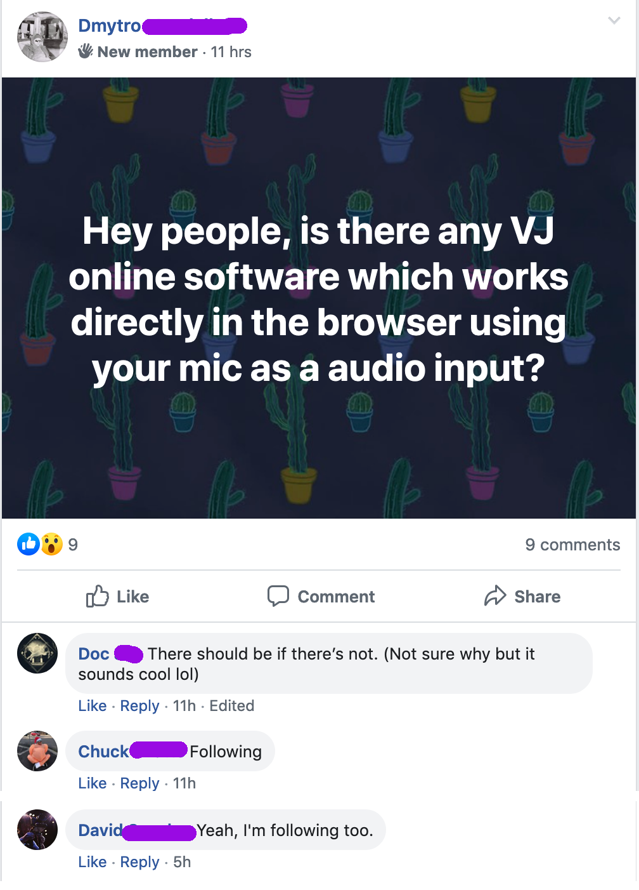

So I needed to validate my idea. For starters, I joined the visual deejays group on Facebook and asked if there were any other apps similar to what I want. I found 2 apps that could do comparable things, but they lack both simplicity and good user experience.
Some people had quite good feedback about the idea. I'm very grateful for the motivation they provided!

Nevertheless, these comments aren't enough to understand something. I'm going to create a landing page of my future software with a product pitch on it and some designs of the actual app. Then ask people to give their emails in the exchange for beta testing participation. That could show me how interested people are and also create a bunch of future testers. **Those people will dictate the functionality of the future app.** Moreover, I'll have validation of my idea which could offer me some possibility of developing this project as a part of my Bachelor's Degree and/or bootstrap a startup.

#### Landing page tech stack:

- Gatsby (React.js framework for rapid development)
- Hotjar (Behaviour analytics)
- Crisp (Capturing leads)

#### Additionally to tech specs, I also need:

- Few early designs of actual product
- Reasons why to chose my application
- Talk with people who wrote me back in facebook post. Find more places to post it when initial design is ready. Question should be:
  1. What do you expect the software to do for you? (3 main expected outcomes)
  2. Are you already using a solution?
- Get testimonials for "social proof"
- Enjoy the journey

I'm a bit afraid of negative results. But since I'm doing this project anyway, results of validation could only influence how much time I spend with not the main features of the app. The main reasons to do the app, remain my portfolio and skillset development.

#### MVP

So I decided that most emphasis of the app would be on the possibility to create own visual scenes. Enabling creative freedom of the users. Users should be able to share scenes with each other, save them and load. Also, would be nice to have the possibility of performing live with these scenes using a computer's or MIDI keyboard. Mic sensitivity calibration functionality is crucial as well. Very good UI/UX, high FPS rate. The most important task is to create an "online audiovisual engine" which would be simple and flexible.

More requirements I'm going to gather during validation campaign.

### Let the development begin!
