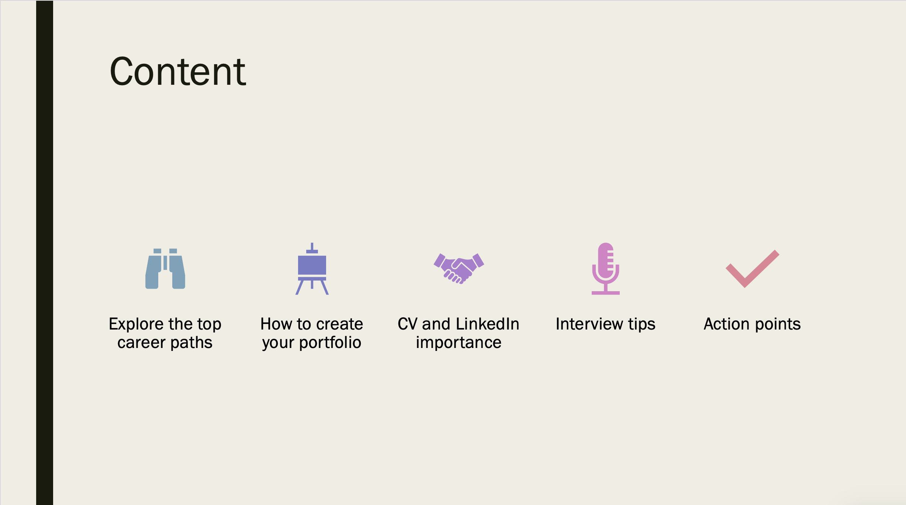
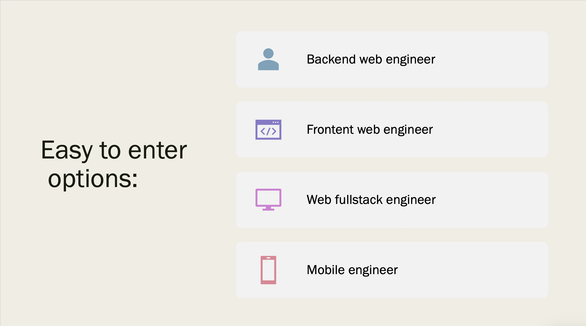
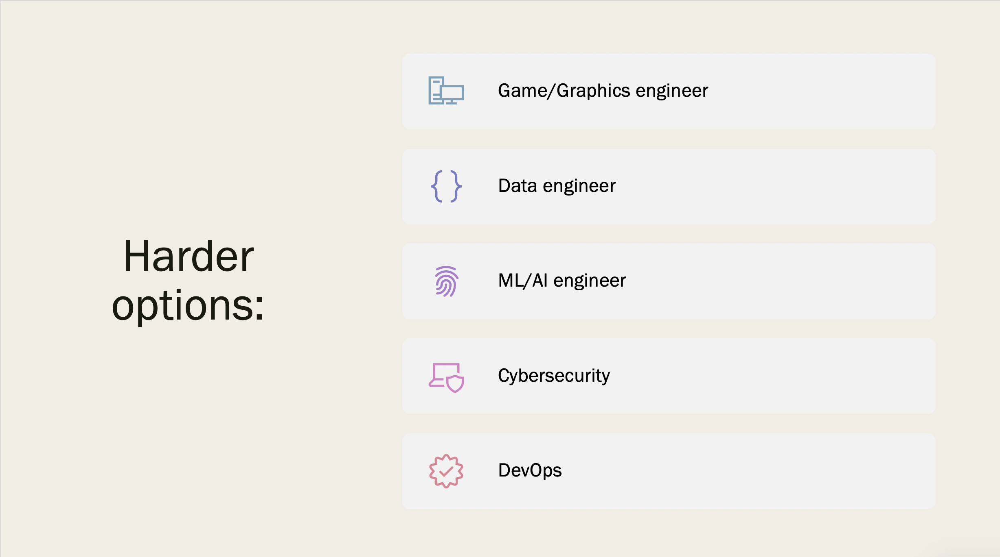
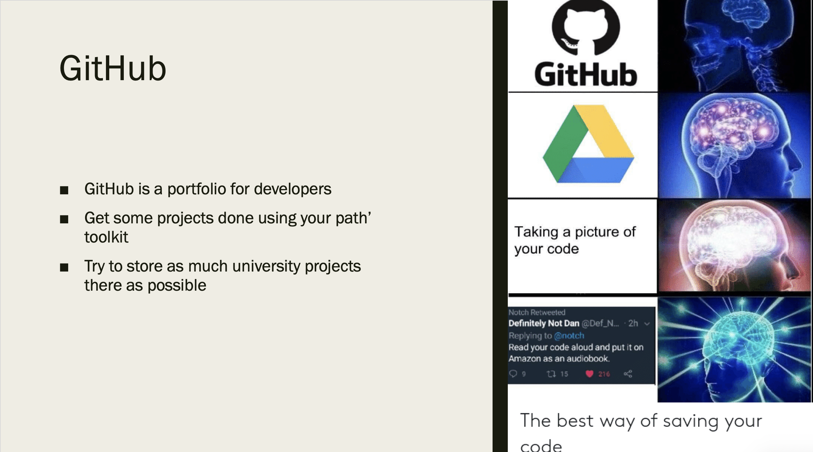
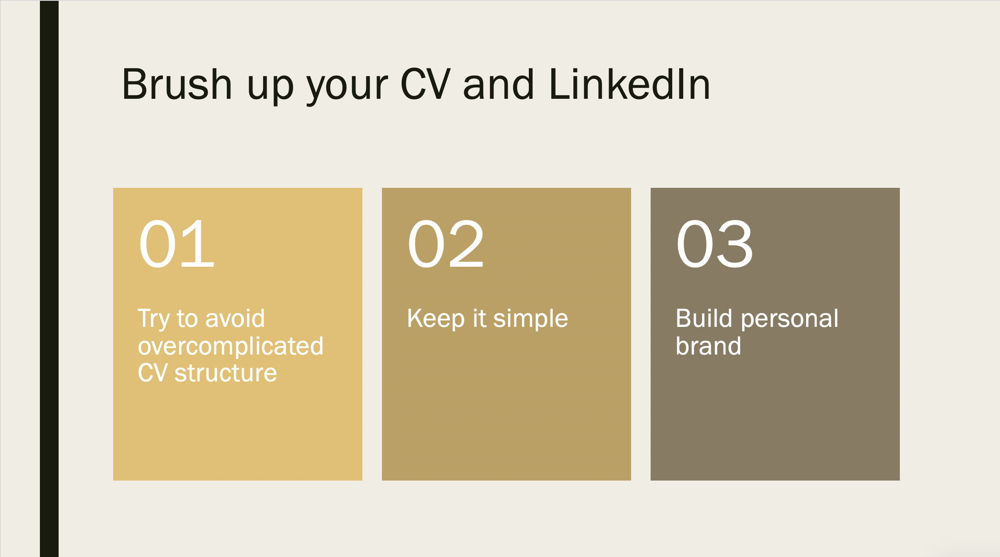
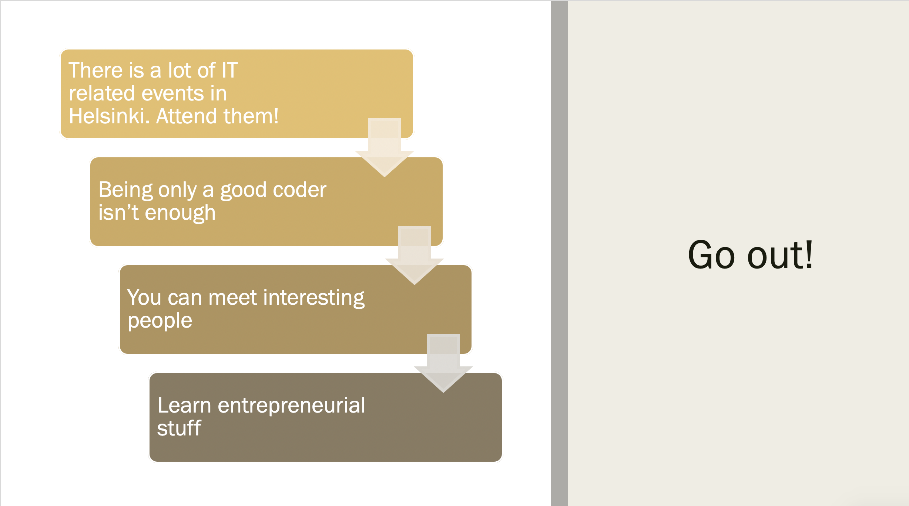
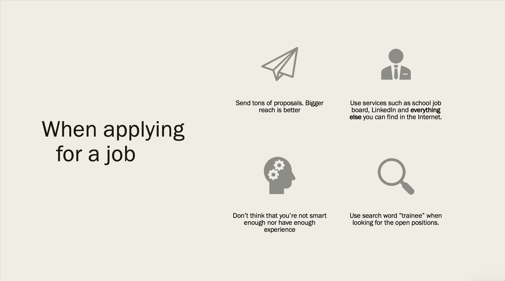
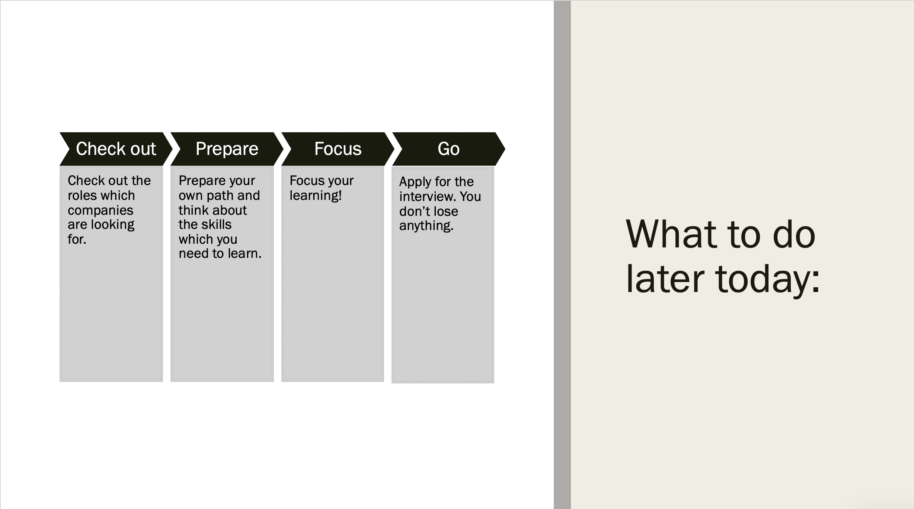
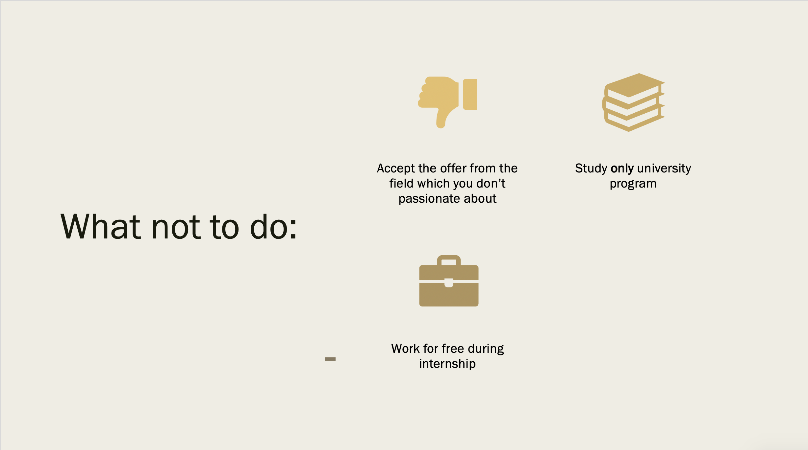

Recently, I was asked by my university representative to give a talk about how to get a job in Finland as an international student. That was a small 30 minutes session for the 1st year students who were just finishing their second semester. That was a lot of fun, here are my slides.

This presentation is mainly aimed at first/second-year students who have their Bachelor's degree in IT field going and looking for a job placement opportunity.

Start early! Your internship is the best time to launch your career, so you should prepare for it beforehand. Choose the desired career path already during the first or second year of your studies. Narrow your focus to this path and go!

Depending on your choice, it can be harder or easier to enter the field. Some fields have entry-level positions quite high, so you need to spend more time preparing.

But the most important part of choosing your path is to follow your passion. Whatever computer-related stuff you feel like doing in your free time, go for it.

After you find out what type of techie you exactly want to be, do your homework and learn how to get into that field. Search what kind of languages and tools are most commonly used in that field. If your university doesn't provide it to you, then it's time to wake up and use the Internet. It's amazing outside of Facebook and Instagram.

While you're still in university doing your no-one needed projects, be sure to store it on GitHub. It will be a nice add-on to your CV.

Helsinki is a truly amazing place known for its startup culture. There are a lot of free tech/business events here. The ones that are not free usually accept help from volunteers. Additionally, you learn how to communicate with people. Companies want only a good coder, but also a good communicator. Calculus and parties, it's all about calculus and parties.

If you want to launch your career, I recommend to chose an internship place that matches your chosen path and where you're going to stay after it ends.

And don't work for free. If you do this, you're dumping the market price for other students.

